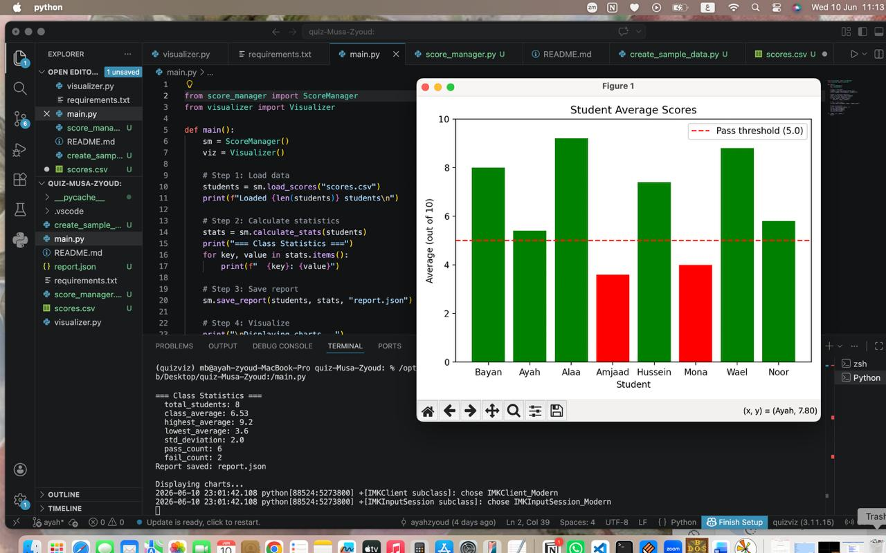
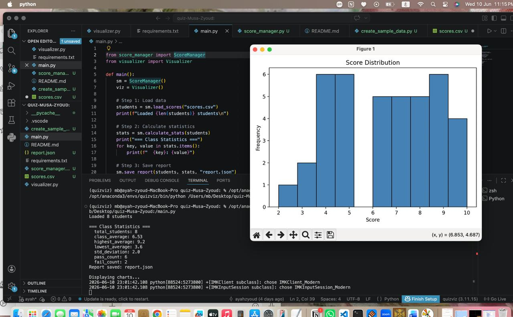
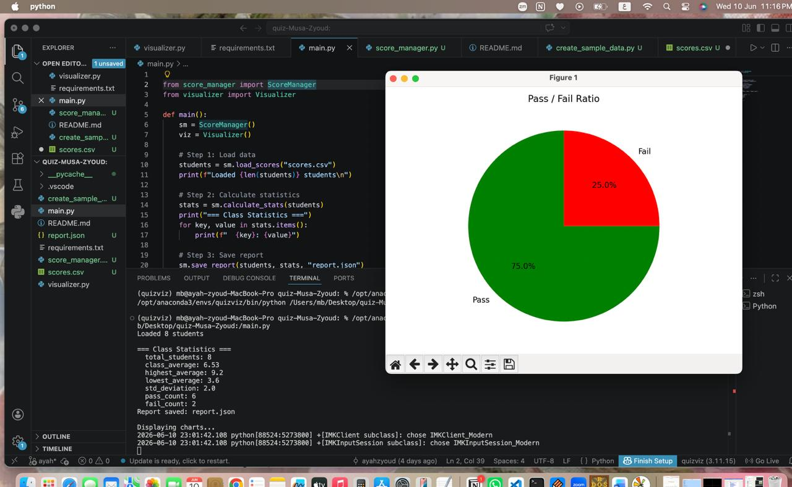
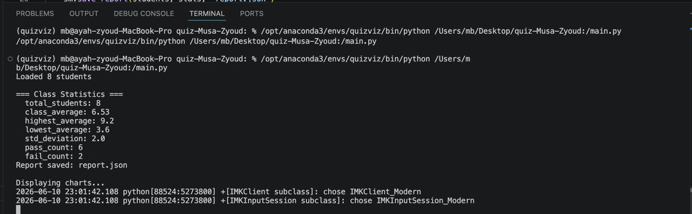

# QuizViz — Student Score Analyzer  
**Course:** Python Programming  


## 1. Project Title & Members

**QuizViz — Student Score Analyzer**  

**Members:**
- Bayan Musa — 202311701 — Responsible for: score_manager.py, create_sample_data.py  
- Ayah Zyoud — 202211628 — Responsible for: visualizer.py, main.py, requirements.txt  

**GitHub Repository:**  
https://github.com/bayanwael711/quizviz-Musa-Zyoud

---

## 2. Project Description

QuizViz is a Python application designed to analyze and visualize student quiz performance. It processes student scores from a dataset, calculate key statistics such as total marks, average, and pass/fail status, and generates a structured JSON report.  

The system also provides visual insights using graphs, including bar charts for student performance, histograms for score distribution, and pie charts for pass/fail ratios.  

The project uses NumPy for numerical calculations and Matplotlib for data visualization, making it easier to understand academic performance trends.

---

## 3. Libraries Used

| Library | Version | How it was used |
|---|---|---|
| numpy | x.x.x | Used for numerical operations such as averages and totals |
| matplotlib | x.x.x | Used to generate bar charts, histograms, and pie charts |


---

## 4. Module Descriptions
**score_manager.py**

This module contains the ScoreManager class responsible for loading student data, processing scores, and generating structured outputs. The key method load_scores() reads a CSV file and converts each row into a dictionary containing student name, quiz scores, total, average, and pass/fail status.

**visualizer.py**

This module handles all data visualization tasks using Matplotlib. It generates a bar chart showing student averages, a histogram showing score distribution, and a pie chart showing the ratio of passed vs failed students.

**main.py**

This is the main entry point of the application. It connects all modules by loading data, calculating statistics, saving the report file, and displaying all visual charts in sequence.
---
## 5. Test Cases
**Test**: load_scores()

Input: scores.csv with 8 students
Expected Output: List of 8 dictionaries with keys: name, q1–q5, total, average, status
Actual Output: Correct list returned ✅

sm = ScoreManager()
students = sm.load_scores("scores.csv")

print(len(students))         # expected: 8
print(students[0].keys())    # expected: dict_keys([...])

**Test**: calculate_stats()

Input: Sample dataset with known values
Expected Output: Correct average and correct pass/fail counts
Actual Output: Matches manual calculation ✅

result = sm.calculate_stats(students)

print(result["average"])
print(result["pass_count"])
print(result["fail_count"])


**Test**: save_report()

Input: Processed student data
Expected Output: Valid report.json file created
Actual Output: File successfully created and verified manually ✅

sm.save_report("report.json", students)
import json
print(json.load(open("report.json")))


**Test**: Full Program Execution

Input: Run main program
Expected Output: No errors + all charts displayed
Actual Output: Program runs successfully and visualizations appear ✅

---
## 6.Screenshots
### Bar Chart

*Average score per student — green = pass, red = fail*

### Histogram

*Distribution of all quiz scores*

### Pie Chart

*Pass vs Fail ratio*

### Terminal Output

*Full output of running python main.py*

## 7. Individual Contributions

| Student |  ID |  Files |  Commit Count  |   GitHub Username | 
|---|---|---|---|---|
| Bayan Musa | 202311701 | score_manager.py, create_sample_data.py | 6 |   bayanwael711  |
| Ayah Zyoud | 202211628 | visualizer.py, main.py, requirements.txt | 9 | ayahzyoud |

---
## 8. Challenges & What We Learned

**Bayan Musa** (202311701):
A challenge was handling invalid or missing values in the CSV file while loading scores. This was solved by validating input.

**Ayah Zyoud** (202211628):
A challenge was correctly aligning labels and values in Matplotlib charts. This was solved by carefully mapping computed statistics to chart labels.

---

## 9. How to Run
### Install dependencies
​```bash
pip install -r requirements.txt
​```
> Generated with `pip freeze > requirements.txt`

### Create sample data
​```bash
python create_sample_data.py
​```

### Run the app
​```bash
python main.py
​```